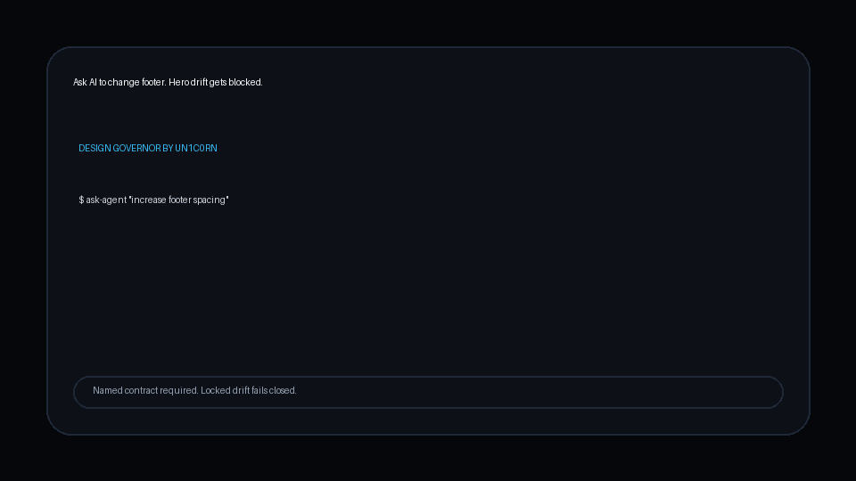

# Design Governor by UN1C0RN

AI coding agents are great at changing websites.
They are also great at accidentally changing parts you already approved.

Design Governor lets you lock approved UI sections as named design contracts.
Before an agent edits, it must name the contract it is allowed to touch.
If the change drifts into a locked area, the governor blocks it.

Plain English by default. Expert detail when you want it.



## Install

```bash
pip install design-governor
python -m playwright install --with-deps chromium
```

For local testing from the repo folder:

```bash
pip install -e .
```

## Quick Start

```bash
design-governor init
design-governor ci-check
design-governor status
design-governor lock --contract-id my.hero.v1 --approved-by "Me"
```

Run the command from the project folder you want to protect. The live registry, runs, and snapshots are created in that folder.
`init` also writes the starter change request file, `AGENTS.md`, and `HOW_IT_WORKS.md`.
It also writes a project config, a GitHub workflow, a pre-commit starter, and an agent workflow guide so the rule is visible in the repo, not only in your terminal.
The governor can also run machine policy checks inside a named contract, not only file-boundary checks.
If a contract defines visual proof specs, the snapshot flow can also capture governed screenshots and compare them to the last approved baseline.
Those specs can point at an absolute route, or use a `base_url` plus route for the target page.
If a contract uses `surface_targets`, the request can also name governed component surfaces, not only whole files.
Strict surface mode can fail closed when a contract points at a file type the governor does not actually support yet.

## Explanation Modes

The default mode is plain.
That means the tool explains what happened in simple language first, then points to the next safe action.

If you want the deeper readout, use:

```bash
design-governor check --request change.json --expert
design-governor check --request change.json --json
```

`--expert` shows exact rule ids, selectors, and file details.
`--json` prints machine output for other tools and automation.

## Visual Proof In CI

Design Governor can take a picture of your page to prove the design still looks right.
Think of Chromium as the camera it uses for that job.

If your contracts use visual proof in GitHub Actions, your workflow still needs two things before `ci-check` runs:

1. your app must be running
2. your visual base URL must be set

The generated workflow now installs Chromium with its Linux runtime dependencies and includes a commented starter block for:

- starting the app
- setting `DESIGN_GOVERNOR_VISUAL_BASE_URL`

Plain version:
start your site, then tell Design Governor where the site is.

Technical detail:
visual proof uses Playwright plus Chromium and can resolve an absolute route, a contract `base_url`, or `DESIGN_GOVERNOR_VISUAL_BASE_URL`.

## Demo

The demo above shows the simplest proof:
ask an agent to change a footer, let the edit drift into a locked hero, and watch the governor block it before the lock is damaged.

Full 60-second walkthrough:
[design-governor-demo-60s.mp4](docs/media/design-governor-demo-60s.mp4)

## Surface Support

Strong now: CSS, HTML, Vue, Svelte, and CSS modules.

Basic now: JSX and TSX. This path is best-effort and works best when the component markup stays explicit and readable.

Partial by contract design: Tailwind utility strings inside supported markup files.

Not yet a strong claim: Sass nesting, styled-components, CSS-in-JS runtime styles, generated class systems, and other unsupported component file kinds. Turn on `strict_surface_mode` if you want those blocked instead of falling back.

## Why This Exists

Unlike linters that check code syntax, Design Governor checks design ownership. It uses structure-based parsing for CSS, HTML, and supported component surfaces so spacing cleanup alone does not break a lock. If a developer, or an AI agent, tries to change a locked design contract without naming it in the request, the governor blocks the move.

## Testing

The public repo carries the full confidence suite.
Run it with:

```bash
python -m playwright install --with-deps chromium
python -m unittest discover -s tests -p "test_*.py"
```

See `TESTING.md` for the release-facing map from product claim to test file.

If you run release audit straight from the source folder with `python -m design_governor release-audit`, the source runner now avoids creating fresh Python cache junk during the run.

## Release Cleanliness

Run this before you cut a public release:

```bash
design-governor release-audit --repo-root . --project-root .
```

If that says the build package is missing, run:

```bash
python -m pip install build
```

Or install the release tools set:

```bash
pip install "design-governor[release]"
```

That audit checks two different surfaces:

1. the repo tree
2. the built source and wheel artifacts

It blocks the release if cache folders, compiled Python files, egg-info junk, build output, or similar clutter shows up in either place.
